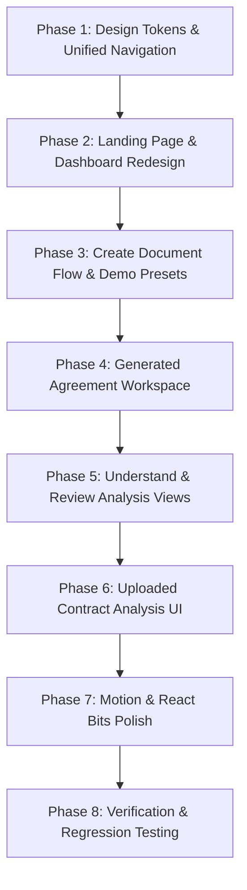

# LegaLese Frontend UI/UX Redesign Blueprint

> **Status:** Comprehensive Plan Created — Awaiting User Review & Approval  
> **Target Aesthetic:** Premium, modern legal-tech SaaS (light theme, Indigo/Violet accents, polished typography, generous whitespace)  
> **Backend Lock:** All AI prompts, schemas, server actions, Gemini calls, Supabase auth/DB, export utilities, and parsing pipelines remain strictly untouched.

---

## 1. Current UI Audit

A thorough audit of the LegaLese frontend codebase reveals the following architecture and component distribution:

### Routes & Pages
- `/` (`app/page.tsx`): Public Landing Page composed of `Header`, `Hero`, `AnalyzeSection`, and `Footer`.
- `/login` (`app/login/page.tsx`): Auth Sign-in page rendering `AuthForm`.
- `/signup` (`app/signup/page.tsx`): Auth Sign-up page rendering `AuthForm`.
- `/auth/callback` (`app/auth/callback/route.ts`): Supabase auth handler.
- `/dashboard` (`app/dashboard/page.tsx`): Main App Dashboard rendering `DashboardNav`, welcome hero, main action cards (Create Document, Analyze Contract), metrics row, `ContractUpload` section, and `DocumentList` (Recent Documents).
- `/dashboard/create` (`app/dashboard/create/page.tsx`): Agreement Creation Hub with `DocumentTypeSelector` and `FreelanceAgreementForm` (with demo data preset buttons).
- `/dashboard/create/[id]` (`app/dashboard/create/[id]/page.tsx`): Generated Document Workspace rendering `GeneratedDocumentWorkspace` (housing View Agreement, Understand Agreement, and Review Agreement views).
- `/dashboard/documents/[id]` (`app/dashboard/documents/[id]/page.tsx`): Uploaded Contract Analysis Detail Page rendering `DetailHeader` and `ContractDetailWorkspace` (AnalysisPanel, Clause list, FindingCards).

### Component Inventory & Duplication Audit
- **Navigation Components:**
  - `components/Header.tsx` (Public landing navbar)
  - `components/dashboard/DashboardNav.tsx` (Authenticated dashboard navbar)
  - *Inconsistency:* `app/dashboard/documents/[id]/page.tsx` contains an inline, hardcoded custom header instead of using `DashboardNav`.
- **Creation & Workspace Components:**
  - `components/create/CreateDocumentSection.tsx`: Form section container.
  - `components/create/DocumentTypeSelector.tsx`: Cards selecting document type (Freelance active; NDA/Employment/Vendor disabled).
  - `components/create/FreelanceAgreementForm.tsx`: Multi-step form with 3 demo presets (Web Dev, UI/UX, Marketing).
  - `components/create/GeneratedDocumentWorkspace.tsx`: Central workspace managing View, Understand, and Review modes.
  - `components/create/DocumentExplanationView.tsx`: Plain-language agreement breakdown component ("Understand").
  - `components/create/DocumentReviewView.tsx`: Risk analysis, missing terms, and clause review component ("Review").
- **Dashboard & Analysis Components:**
  - `components/dashboard/ContractUpload.tsx`: File drag-and-drop / upload widget for existing contracts.
  - `components/dashboard/DocumentList.tsx`: Filterable list rendering saved documents.
  - `components/dashboard/DocumentCard.tsx`: Individual document item card.
  - `components/dashboard/SearchFilterBar.tsx`: Filter tabs and search input for document list.
  - `components/dashboard/DetailHeader.tsx`: Header bar for analyzed contracts showing risk score, status, and export buttons.
  - `components/dashboard/ContractDetailWorkspace.tsx`: 2-column workspace for uploaded contract review.
  - `components/dashboard/AnalysisPanel.tsx`: Right-side tabbed breakdown for findings, clauses, obligations, and key terms.
  - `components/dashboard/FindingCard.tsx`: Risk card displaying high/medium/low risk flags.
- **Shared / Utility UI:**
  - `components/Button.tsx`: Base button component with variant logic.
  - `components/auth/AuthForm.tsx`: Auth card for sign-in and sign-up.
  - `components/auth/SignOutButton.tsx`: Standalone sign-out trigger.
  - `components/Footer.tsx`: Simple landing footer.

---

## 2. Current Problems & Visual Artifacts

1. **Inconsistent Navigation Experience:**
   - Landing page (`Header.tsx`) and Dashboard (`DashboardNav.tsx`) use different heights, padding, brand logo styling, and button styles.
   - Document detail page (`documents/[id]`) uses a 3rd custom inline header without navigation links.
2. **Design Token Fragmentation:**
   - Arbitrary hardcoded HEX codes (`#111827`, `#6366F1`, `#F1F0FF`, `#57534E`, `#EDEDF5`) are mixed with Tailwind classes (`bg-accent`, `text-muted`, `border-border`).
   - Mismatched rounded corner radii across elements (`rounded-md`, `rounded-lg`, `rounded-xl`, `rounded-2xl`, `rounded-[12px]`).
3. **Typography & Layout Scale Issues:**
   - Font sizes lack strict hierarchical contrast (some card titles are `text-2xl` while page titles are `text-3xl`).
   - Text elements appear oversized or crammed depending on screen width.
4. **Unrefined Workspace Flow:**
   - The key product journey (**Create → Understand → Review → Download**) feels fragmented into separate mode buttons rather than a cohesive, guided SaaS pipeline.
   - Action bar buttons for PDF/DOCX export and Copy text lack clean grouping and visual polish.
5. **Leftover Visual Elements:**
   - Miscellaneous experimental CSS classes in `globals.css` and ad-hoc inline styles.
   - Placeholder badges and raw user email strings displayed in navigation headers.

---

## 3. Design Principles

1. **Production-Ready Legal-Tech Trust:** Clean lines, subtle borders, high contrast readability, and deliberate whitespace inspire confidence and legal rigor.
2. **Restrained Modernism:** Avoid flashy 3D effects or excessive background gradients. Use soft surfaces, crisp borders, and purposeful Indigo accents (`#6366F1`).
3. **Intentional Motion:** Micro-interactions (hover shifts, subtle tab transitions, fade-ins) guide user attention without causing visual noise.
4. **Strict Hierarchy & Proportion:** Clear font scaling, explicit contrast between primary text (`#111827`) and secondary metadata (`#64748B`), and uniform card corner radii (8px–12px).

---

## 4. Design Tokens

### Color Palette

| Token Role | Hex Code | Tailwind / CSS Variable | Description |
| :--- | :--- | :--- | :--- |
| **Background** | `#F7F8FC` | `bg-background` (`--background`) | Soft off-white page background |
| **Surface** | `#FFFFFF` | `bg-surface` (`--surface`) | Clean white card and header background |
| **Primary** | `#6366F1` | `text-primary`, `bg-primary` | Signature Indigo accent color |
| **Primary Hover** | `#4F46E5` | `hover:bg-primary-hover` | Darker Indigo for active states |
| **Soft Primary** | `#EEF2FF` | `bg-primary-soft` | Soft tint for active badges/tabs |
| **Main Text** | `#111827` | `text-foreground` | Deep slate font for primary text |
| **Secondary Text** | `#64748B` | `text-secondary` | Medium slate font for descriptions |
| **Muted Text** | `#94A3B8` | `text-muted` | Light slate font for metadata/captions |
| **Border** | `#E5E7EB` | `border-border` | Subtle divider border line |
| **Success** | `#10B981` | `text-emerald-600`, `bg-emerald-50` | Emerald for low risk / completed |
| **Warning** | `#F59E0B` | `text-amber-600`, `bg-amber-50` | Amber for medium risk / review needed |
| **Danger** | `#EF4444` | `text-rose-600`, `bg-rose-50` | Rose/Red for high risk / missing terms |

### Typography Scale

- **Font Family:** `Geist Sans` (fallback: `-apple-system, BlinkMacSystemFont, "Segoe UI", Roboto, sans-serif`)
- **Landing Hero Title:** `56px` – `64px` | `font-extrabold` | `tracking-tight` | `leading-[1.1]`
- **Page Main Headings:** `32px` – `36px` | `font-bold` | `tracking-tight` | `leading-snug`
- **Section / Card Headings:** `18px` – `20px` | `font-semibold` | `tracking-tight`
- **Body Text:** `15px` – `16px` | `font-normal` | `leading-relaxed` (`#111827`)
- **Secondary Text:** `14px` | `font-normal` | `leading-normal` (`#64748B`)
- **Small Metadata & Badges:** `12px` – `13px` | `font-medium` | `tracking-wide`
- **Navbar Links:** `14px` | `font-medium`

### Spacing, Radii & Elevation
- **Border Radius System:**
  - Cards & Workspaces: `rounded-xl` (`12px`)
  - Modals & Dropdowns: `rounded-2xl` (`16px`)
  - Buttons & Form Inputs: `rounded-lg` (`8px`)
  - Badges & Small Chips: `rounded-md` (`6px`)
- **Elevation Shadows:**
  - Surface elevation: `box-shadow: 0 1px 2px 0 rgba(0, 0, 0, 0.03), 0 4px 12px -2px rgba(0, 0, 0, 0.02)`
  - Hover elevation: `box-shadow: 0 4px 6px -1px rgba(0, 0, 0, 0.05), 0 10px 20px -3px rgba(0, 0, 0, 0.04)`

---

## 5. Unified Navigation Redesign (`DashboardNav.tsx`)

The main navbar will be consolidated into a single, highly polished header reused across all authenticated screens (`/dashboard`, `/dashboard/create`, `/dashboard/create/[id]`, `/dashboard/documents/[id]`).

### Navbar Layout & Features:
1. **Height:** Fixed `68px` with sticky top position, `bg-white/90`, backdrop blur (`backdrop-blur-md`), and a crisp bottom border (`#E5E7EB`).
2. **Left Brand Mark:**
   - Refined Indigo icon box containing paragraph symbol (`§`) with soft background (`#EEF2FF`).
   - Clean typography: **Lega** (`#111827`) **Lese** (`#6366F1`) with smooth hover state.
3. **Center Navigation Items:**
   - **Home** (`/dashboard`): Active highlight using soft indigo background (`#EEF2FF`) and Indigo text (`#6366F1`).
   - **Create Document** (`/dashboard/create`): Direct creation entrypoint.
   - **My Documents** (`/dashboard#documents`): Smooth scroll or route to user document list.
   - **Analyze Contract** (`/dashboard#upload`): Smooth scroll to contract upload dropzone.
   - **Community** (`Coming Soon`): Visible link with a small, clean `Coming Soon` badge (`bg-indigo-50`, `text-indigo-600`).
   - **Legal Expert** (`Coming Soon`): Visible roadmap item with clean `Coming Soon` badge.
4. **Right Side Profile Avatar:**
   - Sleek `36px` circular user avatar displaying user initial (e.g. "R" or "U") on soft Indigo fill (`#EEF2FF`).
   - NO full email string rendered inline on the header bar.
   - Clickable dropdown menu showing user email in mono font, link to settings/dashboard, and Sign Out action.
5. **Mobile Responsiveness:**
   - Mobile hamburger menu drawer with smooth toggle and clean layout collapse on screens below `768px`.

---

## 6. Page-by-Page Redesign Plan

### 1. Landing / Home Page (`app/page.tsx`, `Hero.tsx`, `AnalyzeSection.tsx`, `Footer.tsx`)
- **Header:** Public navigation with clean logo, "Sign in" link, and primary "Get Started" Indigo button.
- **Hero Section:**
  - Split layout or centered headline with Split-Text entrance animation.
  - Headline: *"Understand legal contracts before you sign."*
  - Subtitle: *"AI-powered agreement generation, plain-language contract explanations, and risk analysis for freelancers and modern businesses."*
  - CTAs: Primary *"Create Agreement →"* button and Secondary *"Analyze Existing Contract"* button.
  - Interactive Preview Box / Spotlight Card demonstrating before/after legalese simplification.
- **Analyze Section:**
  - 3-step value proposition: **1. Create** → **2. Understand** → **3. Review & Export**.
  - Feature cards using React Bits Spotlight hover effect.

### 2. Dashboard (`app/dashboard/page.tsx`)
- **Welcome Hero Area:**
  - Clean greeting *"Welcome back"* with subtle date subtitle.
- **Primary Action Grid (2-Column Spotlight Cards):**
  - **Card 1: Create a Legal Document:** Icon (`📝`), Title, description, and primary Indigo action button (`Create Document →`).
  - **Card 2: Analyze an Existing Contract:** Icon (`🔍`), Title, description, and outlined Indigo action button (`Upload & Analyze →`).
- **Metrics Summary Bar (3 Cards):**
  - Total Contracts, Analyzed Documents, Needs Attention. Styled with soft white surfaces, clean numbers, and muted uppercase captions.
- **Upload Dropzone Section (`ContractUpload.tsx`):**
  - Redesigned dropzone with dashed border (`#6366F1` on hover), drag-and-drop file state, format icons (PDF, DOCX), and clear upload CTA.
- **Recent Documents Table (`DocumentList.tsx`, `DocumentCard.tsx`):**
  - Tabbed search & filter bar (`SearchFilterBar.tsx`) allowing filtering by "All", "Generated", "Analyzed", and risk level.
  - Document cards with clear status pills (Complete, Needs Attention, Processing), created dates, risk badges, and direct action buttons.

### 3. Create Document Hub (`app/dashboard/create/page.tsx`)
- **Header:** Breadcrumb navigation `Dashboard / Create Document`.
- **Selector Grid (`DocumentTypeSelector.tsx`):**
  - **Freelance Agreement Card (Active):** Featured card with Indigo border, checkmark badge, description, and estimate generation time (~10s).
  - **NDA / Non-Disclosure (Roadmap):** Styled disabled card with "Coming Soon" badge.
  - **Employment Contract (Roadmap):** Styled disabled card with "Coming Soon" badge.
  - **Vendor Agreement (Roadmap):** Styled disabled card with "Coming Soon" badge.
- **Form Section Container:** Clean white card hosting the multi-step form.

### 4. Freelance Agreement Form (`FreelanceAgreementForm.tsx`)
- **Demo Data Toolbar:**
  - Highly visible preset selection bar at top of form:
    - `[ ⚡ Try Web Dev Preset ]`
    - `[ ⚡ Try UI/UX Design Preset ]`
    - `[ ⚡ Try Digital Marketing Preset ]`
  - Styled with subtle Indigo pill buttons and click micro-animations to immediately fill form fields for quick testing.
- **Form Sections (Structured Stepper or Accordion):**
  - Section 1: Party Details (Freelancer & Client)
  - Section 2: Services & Deliverables
  - Section 3: Timeline & Compensation
  - Section 4: Termination & IP Rights
  - Section 5: Governing Law & Jurisdiction
- **Submit Action:** Full-width primary button *"Generate Freelance Agreement with AI"* with sleek loading spinner and progress state.

### 5. Generated Agreement Workspace (`app/dashboard/create/[id]/page.tsx`, `GeneratedDocumentWorkspace.tsx`)
- **Central Product Layout (2-Panel / Split View):**
  - **Header Action Bar:**
    - Left: Document title & created metadata, breadcrumb link back to Create/Dashboard.
    - Right: Unified Export Dropdown & Direct Download buttons (`PDF`, `DOCX`, `Markdown`, `Copy Text`).
  - **Pipeline Navigation Tabs (Top Center):**
    - `[ 📄 View Agreement ]` → `[ 💡 Understand ]` → `[ ⚠️ Review ]` → `[ ⚙️ Customize (Coming Soon) ]`
    - Smooth active tab indicator with soft indigo background.
  - **Main Content Area:**
    - **Mode 1: View Agreement:** Rendered agreement paper view with clean legal typography, numbered clauses, and print/export readiness.
    - **Mode 2: Understand Agreement (`DocumentExplanationView.tsx`):** Plain-language breakdown of key obligations, payment terms, IP ownership, and cancellation terms.
    - **Mode 3: Review Agreement (`DocumentReviewView.tsx`):** Risk score banner, identified risk flags, missing protective clauses, and recommended revisions.
    - **Mode 4: Customize (Roadmap):** Clean preview state with "Coming Soon — AI Clause Editor" banner.

### 6. Uploaded Contract Detail Workspace (`app/dashboard/documents/[id]/page.tsx`, `ContractDetailWorkspace.tsx`, `DetailHeader.tsx`, `AnalysisPanel.tsx`)
- **Header Bar (`DetailHeader.tsx`):**
  - Unified `DashboardNav` at top.
  - Document Title, File metadata (PDF/DOCX), Analysis Risk Score Pill (Score 1 = Low Risk Emerald, Score 2 = Medium Risk Amber, Score 3 = High Risk Rose).
  - Export PDF Report action button.
- **2-Column Analysis Layout:**
  - **Left Column (Document Viewer / Clause Navigator):** Interactive list of extracted clauses with quick search filter.
  - **Right Column (`AnalysisPanel.tsx`):**
    - Tab bar: `Findings (Risks)` | `Key Terms` | `Obligations` | `Executive Summary`.
    - `FindingCard.tsx`: Formatted risk cards with category icons, risk severity badge, and clause reference link.

---

## 7. React Bits Integration Strategy

We will integrate selected lightweight, zero-dependency visual components inspired by [React Bits](https://reactbits.dev/):

1. **Spotlight Card (`components/ui/SpotlightCard.tsx`)**
   - *Where:* Primary action cards on Dashboard (Create Document, Upload Contract) and Landing Page features.
   - *Why:* Creates a subtle radial cursor-following glow that feels ultra-premium without adding heavy JS.
2. **Animated List / Stagger Fade (`components/ui/AnimatedList.tsx`)**
   - *Where:* Contract findings list, document lists, and clause breakdown items.
   - *Why:* Gives smooth stagger-in entrance when loading AI analysis findings or filtering documents.
3. **Split Text / Fade-in Text (`components/ui/SplitText.tsx`)**
   - *Where:* Landing Page hero header & primary page titles.
   - *Why:* Creates an engaging initial impression upon page load.
4. **Glass Card Surface (`components/ui/GlassSurface.tsx`)**
   - *Where:* Sticky top navbar and floating export action toolbar.
   - *Why:* Provides subtle backdrop blur (`backdrop-blur-md`) for modern SaaS depth.

> **Restraint Note:** Motion is strictly scoped to structural entrance and state transitions. No disruptive continuous loop animations or heavy 3D canvases will be added.

---

## 8. Preserving Upcoming Features ("Coming Soon")

The following features must remain visible in the UI as polished product roadmap items:
1. **Community Tab** in Navbar (`DashboardNav.tsx`): Rendered with a subtle `#EEF2FF` pill badge stating `Coming Soon`.
2. **Legal Expert Tab** in Navbar (`DashboardNav.tsx`): Rendered with a subtle `#EEF2FF` pill badge stating `Coming Soon`.
3. **Document Type Cards** (`DocumentTypeSelector.tsx`): NDA, Employment Contract, and Vendor Agreement rendered with disabled surfaces and `Coming Soon` badges.
4. **Customize Tab** in Agreement Workspace (`GeneratedDocumentWorkspace.tsx`): Rendered in pipeline tab bar with a `Coming Soon` badge, opening an informative roadmap card when clicked.

---

## 9. Seamless Demo Experience Flow

For live presentations and user demos, the end-to-end user journey will be streamlined:

$$\text{Dashboard} \xrightarrow{\text{Click "Create"}} \text{Create Hub} \xrightarrow{\text{Select "Freelance"}} \text{Form} \xrightarrow{\text{Click "⚡ Web Dev Preset"}} \text{Pre-filled Form} \xrightarrow{\text{Click "Generate"}} \text{AI Processing} \xrightarrow{\text{Workspace (View → Understand → Review → Export PDF)}}$$

- **Demo Preset Buttons** will be prominently featured at the top of `FreelanceAgreementForm.tsx`.
- **Instant Pre-fill** populates all fields with realistic Indian legal-tech test data in 1 click.
- **Workspace Pipeline Tabs** allow toggling between plain-language explanation and risk review in 1 click.

---

## 10. File Modification Breakdown

### Files to Modify (Frontend Layer Only)
- `app/globals.css`: Update root color variables and utility classes.
- `components/Header.tsx`: Align with new public design system.
- `components/dashboard/DashboardNav.tsx`: Rebuild unified SaaS header with profile popover and responsive mobile drawer.
- `components/Hero.tsx`: Update landing hero text, buttons, and preview layout.
- `components/AnalyzeSection.tsx`: Update landing feature cards & layout.
- `components/Footer.tsx`: Clean up landing footer typography.
- `app/dashboard/page.tsx`: Redesign dashboard hero, action cards, metrics, and document table layout.
- `components/dashboard/ContractUpload.tsx`: Redesign dropzone visual state and upload progress UI.
- `components/dashboard/DocumentList.tsx` & `DocumentCard.tsx`: Redesign table rows, status pills, and card list.
- `components/dashboard/SearchFilterBar.tsx`: Redesign search bar and tab filters.
- `app/dashboard/create/page.tsx`: Redesign document selection hub.
- `components/create/DocumentTypeSelector.tsx`: Update active/disabled card styles.
- `components/create/FreelanceAgreementForm.tsx`: Redesign multi-step form layout and demo preset toolbar.
- `app/dashboard/create/[id]/page.tsx`: Wrap workspace with unified `DashboardNav`.
- `components/create/GeneratedDocumentWorkspace.tsx`: Redesign workspace split view, top pipeline tabs, and header export bar.
- `components/create/DocumentExplanationView.tsx`: Redesign plain-language breakdown cards.
- `components/create/DocumentReviewView.tsx`: Redesign risk score banner and missing terms cards.
- `app/dashboard/documents/[id]/page.tsx`: Replace custom inline header with unified `DashboardNav`.
- `components/dashboard/DetailHeader.tsx`: Redesign contract title bar and risk score pill.
- `components/dashboard/ContractDetailWorkspace.tsx`: Redesign 2-column analysis layout.
- `components/dashboard/AnalysisPanel.tsx` & `FindingCard.tsx`: Redesign findings list, tabs, and risk severity badges.
- `components/auth/AuthForm.tsx`: Redesign sign-in and sign-up card container.

### Files to CREATE (New Reusable UI / Motion Components)
- `components/ui/SpotlightCard.tsx`: React Bits spotlight card hover component.
- `components/ui/AnimatedList.tsx`: Lightweight list transition wrapper.

### Files that MUST NOT BE MODIFIED (Backend & Logic Locked)
- `lib/ai/*` (`gemini.ts`, `generation.ts`, `explanation.ts`, `review.ts`, `scorer.ts`, prompts, schemas)
- `lib/actions/*` (`auth.ts`, `generated-documents.ts`, `explanation.ts`, `review.ts`, `analyses.ts`, `reports.ts`)
- `lib/generation/export.ts` & export endpoints
- `lib/supabase/*` (client, server, middleware, RLS)
- `types/*` (`database.ts`, `analysis.ts`, `generation.ts`)
- Document parsing utilities (`mammoth`, `unpdf`, `pdfkit`)

---

## 11. Phased Implementation Plan

### PHASE 1 — Design Tokens + Unified Navigation
- Establish CSS variables in `app/globals.css` matching design tokens.
- Rebuild `components/dashboard/DashboardNav.tsx` as the single unified navbar.
- Update `components/Header.tsx` for landing page alignment.

### PHASE 2 — Landing Page + Dashboard Redesign
- Redesign `app/page.tsx`, `Hero.tsx`, `AnalyzeSection.tsx`, `Footer.tsx`.
- Redesign `app/dashboard/page.tsx` hero, action cards, metric cards, and document list.

### PHASE 3 — Create Document Flow & Demo Presets
- Redesign `app/dashboard/create/page.tsx` and `DocumentTypeSelector.tsx`.
- Redesign `FreelanceAgreementForm.tsx` form controls and highlight Demo Preset buttons.

### PHASE 4 — Agreement Workspace
- Redesign `GeneratedDocumentWorkspace.tsx` layout, top pipeline tabs, paper document viewer, and export bar.

### PHASE 5 — Understand + Review Views
- Redesign `DocumentExplanationView.tsx` cards and bullet lists.
- Redesign `DocumentReviewView.tsx` risk banner, missing terms cards, and recommendation boxes.

### PHASE 6 — Analyze Contract UI
- Redesign `ContractUpload.tsx` dropzone.
- Redesign `app/dashboard/documents/[id]/page.tsx`, `DetailHeader.tsx`, `ContractDetailWorkspace.tsx`, `AnalysisPanel.tsx`, and `FindingCard.tsx`.

### PHASE 7 — Motion + Final Polish
- Implement `SpotlightCard` and `AnimatedList` from React Bits.
- Ensure micro-animations, hover effects, and active tab transitions operate smoothly across light mode.

### PHASE 8 — Full Regression Testing
- Test end-to-end creation flow with Demo Presets.
- Test PDF, DOCX, and Markdown export actions.
- Test uploaded contract parsing and analysis rendering.
- Verify responsive layout on mobile, tablet, and desktop screens.

---

## 12. Verification Checklist

- [ ] Design system tokens (`#F7F8FC` background, `#FFFFFF` surfaces, `#6366F1` Indigo primary) correctly applied globally.
- [ ] Unified `DashboardNav` applied across `/dashboard`, `/dashboard/create`, `/dashboard/create/[id]`, `/dashboard/documents/[id]`.
- [ ] Profile avatar in header displays initials/avatar without raw email string.
- [ ] Landing hero typography is bold, clean, and appropriately sized (no cheap oversized fonts).
- [ ] Demo preset buttons in `FreelanceAgreementForm` populate fields seamlessly.
- [ ] AI agreement generation action completes successfully.
- [ ] Generated document workspace tabs (**View → Understand → Review**) toggle cleanly.
- [ ] PDF, DOCX, and Markdown exports download valid files.
- [ ] PDF upload dropzone functions properly and renders contract analysis findings.
- [ ] Upcoming features (Community, Legal Expert, Customize) remain clearly presented with `Coming Soon` badges.
- [ ] Code in `lib/ai`, `lib/actions`, `lib/generation`, `lib/supabase`, and database schemas remains completely unchanged.
