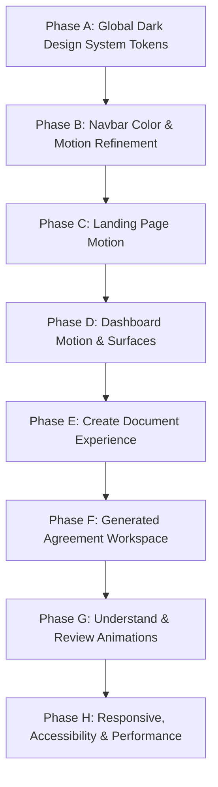

# LegaLese Visual & Motion Evolution Plan
## Dark-First Supabase Aesthetic + React Bits Interaction Blueprint

> **Status:** Created Plan — Awaiting User Approval  
> **Visual Philosophy:** Supabase-level product polish + React Bits-level micro-interaction + legal-tech trustworthiness.  
> **Backend & Core Logic Lock:** All Gemini AI prompts, schemas, server actions, Supabase auth/DB, export handlers (PDF/DOCX/Markdown), and file parsing pipelines remain 100% locked.

---

## 1. Color Tokens System

All colors will be managed centrally via CSS variables in `app/globals.css`. Components will consume these tokens exclusively without hardcoding HEX strings.

| Token Key | HEX / RGBA | Role / Usage |
| :--- | :--- | :--- |
| `--background` | `#0B0F0D` | Deep dark canvas background |
| `--surface` | `#111714` | Card & sidebar surface |
| `--surface-elevated` | `#151C18` | Floating dropdowns, modals, floating action bars |
| `--surface-hover` | `#1A231E` | Hover state for interactive cards and list items |
| `--primary` | `#3ECF8E` | Supabase Emerald Green — Primary CTAs, active indicators, brand accent |
| `--primary-hover` | `#2FB77A` | Darker emerald for button hover states |
| `--primary-soft` | `rgba(62, 207, 142, 0.10)` | Soft emerald tint for badges, active tabs, and highlights |
| `--foreground` | `#F5F7F6` | High contrast primary text |
| `--secondary` | `#A7B0AB` | Body text, section subtitles, metadata |
| `--muted` | `#6F7973` | Captions, disabled controls, placeholder text |
| `--border` | `rgba(255, 255, 255, 0.08)` | Subtle card and section dividers |
| `--border-strong` | `rgba(255, 255, 255, 0.14)` | Hover borders, active inputs, modal borders |
| `--success` | `#3ECF8E` | Low risk / completed status badges |
| `--warning` | `#F5B94C` | Amber warning / medium risk flags |
| `--danger` | `#EF6B73` | Rose red / high risk flags / destructive actions |

### Strategic Color Distribution Rules:
- Primary Emerald (`#3ECF8E`) will be used **sparingly** (~10% of screen surface): Primary action buttons, active navigation indicator, brand mark icon, and success/low-risk indicators.
- Neutral surfaces (`#0B0F0D`, `#111714`, `#151C18`) dominate ~90% of the UI to prevent neon overload or distracting "gamer" aesthetics.

---

## 2. Typography System

We preserve the existing compact, restrained typography scale to ensure density and readability.

- **Font Family:** `Geist Sans` with monospace fallback for legal clause numbers and dates.
- **Landing Hero Headline:** `48px` – `56px` | `font-extrabold` | `tracking-tight` | `leading-[1.15]`
- **Page Headings:** `28px` – `32px` | `font-bold` | `tracking-tight`
- **Card Headings:** `16px` – `18px` | `font-bold`
- **Body Text:** `14px` – `15px` | `font-normal` | `leading-relaxed` (`#F5F7F6`)
- **Secondary / Captions:** `13px` – `14px` | `font-normal` (`#A7B0AB`)
- **Badges / Monospace Info:** `11px` – `12px` | `font-mono` | `font-semibold`

---

## 3. Surface, Border & Elevation System

- **Card Surfaces:** Deep dark `#111714` with `1px` subtle border `rgba(255, 255, 255, 0.08)`.
- **Hover Micro-Interactions:** Smooth `200ms` transition to `#1A231E` with subtle border shift to `rgba(255, 255, 255, 0.14)` and `-2px` Y-axis lift.
- **Paper Document Surface (Generated Workspace):** Clean, crisp paper-like white container (`#FFFFFF` with `#111827` dark legal text) nested inside the dark `#0B0F0D` SaaS workspace, guaranteeing 100% legal document readability.

---

## 4. Animation & Motion Strategy

Centralized timing variables and easing curves for smooth, restrained interaction:

- **Fast (150ms – 200ms):** Button hover, tab active state toggles, input focus outlines. `cubic-bezier(0.16, 1, 0.3, 1)`
- **Normal (250ms – 350ms):** Card hover elevation, dropdown popover fade, tab panel switching. `cubic-bezier(0.16, 1, 0.3, 1)`
- **Slow (400ms – 600ms):** Hero text entrance, staggered list loading. `cubic-bezier(0.16, 1, 0.3, 1)`

---

## 5. React Bits Component Assessment

### ✅ React Bits Components to Integrate:
1. **SpotlightCard (`components/ui/SpotlightCard.tsx`):**
   - Radial cursor-following glow in emerald tint (`rgba(62, 207, 142, 0.08)`).
   - Applied to Dashboard primary action cards ("Create Document" & "Analyze Contract").
2. **AnimatedList (`components/ui/AnimatedList.tsx`):**
   - Staggered entrance animation for document lists, contract findings, and key obligations.
3. **Magnet CTA (`components/ui/Magnet.tsx`):**
   - Subtle magnetic pull on mouse hover for the primary "Create Document" CTA button.
4. **Scroll Reveal (`components/ui/ScrollReveal.tsx`):**
   - Smooth entrance reveals for Landing Page feature sections.
5. **Split Text / Fade Content:**
   - Soft text entrance on Landing hero section.

### ❌ React Bits Components NOT to Use:
- Heavy 3D WebGL / Canvas shaders.
- Chaotic floating particles or neon light trails.
- Bouncing spring physics on core dashboard buttons.

---

## 6. Page-by-Page Motion & Dark Theme Plan

### A. Navigation Header (`DashboardNav.tsx`)
- Architectural structure remains **100% unchanged** (Home, Create Document, My Documents, Analyze Contract, Community [Coming Soon], Legal Expert [Coming Soon], Profile Avatar).
- Dark canvas surface `#111714` with subtle bottom border `rgba(255,255,255,0.08)`.
- Active tab state: Soft emerald background `rgba(62, 207, 142, 0.10)` with `#3ECF8E` text.

### B. Landing Page (`app/page.tsx`, `Hero.tsx`, `AnalyzeSection.tsx`, `Footer.tsx`)
- Dark canvas `#0B0F0D` with restrained emerald radial glow.
- Hero title: *"Understand legal contracts before you sign."* with split-text entrance.
- CTAs: Primary Emerald button *"📝 Create Document"* with Magnet effect + Secondary border button *"🔍 Analyze Existing Contract"*.
- Interactive transformation preview card contrasting legalese vs plain-language summary.

### C. Dashboard (`app/dashboard/page.tsx`, `ContractUpload.tsx`, `DocumentList.tsx`)
- Deep dark canvas with 2-column Spotlight action cards.
- Metrics cards with `#3ECF8E` stat numbers.
- File upload dropzone with dashed emerald border on drag hover.
- Staggered `AnimatedList` entrance for recent documents.

### D. Generated Document Workspace (`GeneratedDocumentWorkspace.tsx`, `DocumentExplanationView.tsx`, `DocumentReviewView.tsx`)
- Dark SaaS shell with top pipeline tabs:
  `[ 📄 View Agreement ]` → `[ 💡 Understand ]` → `[ ⚠️ Review ]` → `[ ⚙️ Customize (Coming Soon) ]`
- Paper Document Viewer: Crisp white background (`#FFFFFF`) with dark legal text (`#111827`) for uncompromised readability.
- Understand & Review views: Elevated dark cards with emerald, amber, and rose severity tags.

---

## 7. Accessibility Strategy

- **`prefers-reduced-motion` Enforcement:** When reduced motion is enabled, all transform shifts and staggered delays are disabled, keeping simple opacity fades.
- **Color Contrast:** High-contrast text `#F5F7F6` against `#111714` surface exceeds WCAG AAA standards.

---

## 8. Phased Implementation Roadmap

- **PHASE A:** Global dark design system in `app/globals.css` (`#0B0F0D`, `#111714`, `#3ECF8E`).
- **PHASE B:** Navbar color/motion refinement (`DashboardNav.tsx`, `Header.tsx`).
- **PHASE C:** Landing page dark theme & motion (`Hero.tsx`, `AnalyzeSection.tsx`).
- **PHASE D:** Dashboard action cards & list animations (`app/dashboard/page.tsx`, `ContractUpload.tsx`, `DocumentList.tsx`).
- **PHASE E:** Create document hub & form presets (`create/page.tsx`, `FreelanceAgreementForm.tsx`).
- **PHASE F:** Generated agreement workspace & paper viewer (`GeneratedDocumentWorkspace.tsx`).
- **PHASE G:** Plain-language & risk review card animations (`DocumentExplanationView.tsx`, `DocumentReviewView.tsx`).
- **PHASE H:** Responsive, accessibility & full build verification.

---

## 9. File Action Audit

### Files to Modify (Presentation Layer Only)
- `app/globals.css`
- `components/dashboard/DashboardNav.tsx`
- `components/Header.tsx`
- `components/Hero.tsx`
- `components/AnalyzeSection.tsx`
- `components/Footer.tsx`
- `app/dashboard/page.tsx`
- `components/dashboard/ContractUpload.tsx`
- `components/dashboard/DocumentList.tsx`
- `components/dashboard/DocumentCard.tsx`
- `components/dashboard/SearchFilterBar.tsx`
- `app/dashboard/create/page.tsx`
- `components/create/DocumentTypeSelector.tsx`
- `components/create/FreelanceAgreementForm.tsx`
- `components/create/GeneratedDocumentWorkspace.tsx`
- `components/create/DocumentExplanationView.tsx`
- `components/create/DocumentReviewView.tsx`
- `app/dashboard/documents/[id]/page.tsx`
- `components/dashboard/DetailHeader.tsx`
- `components/dashboard/ContractDetailWorkspace.tsx`
- `components/dashboard/AnalysisPanel.tsx`
- `components/dashboard/FindingCard.tsx`
- `components/ui/SpotlightCard.tsx`
- `components/ui/AnimatedList.tsx`

### Files to KEEP STRICTLY UNTOUCHED (Backend Locked)
- `lib/ai/*` (`gemini.ts`, prompts, schemas, `scorer.ts`)
- `lib/actions/*` (all server actions)
- `lib/generation/export.ts` & export routes
- `lib/supabase/*` & auth logic
- `types/*`
- Document parsers (`mammoth`, `unpdf`, `pdfkit`)

---

## 10. Verification Strategy for Each Phase

For every phase:
1. Execute `npm run lint` (Must pass with 0 errors).
2. Execute `npm run build` (Must pass with 0 errors).
3. Manually check affected route UI & navigation.
4. STOP and present progress report.
